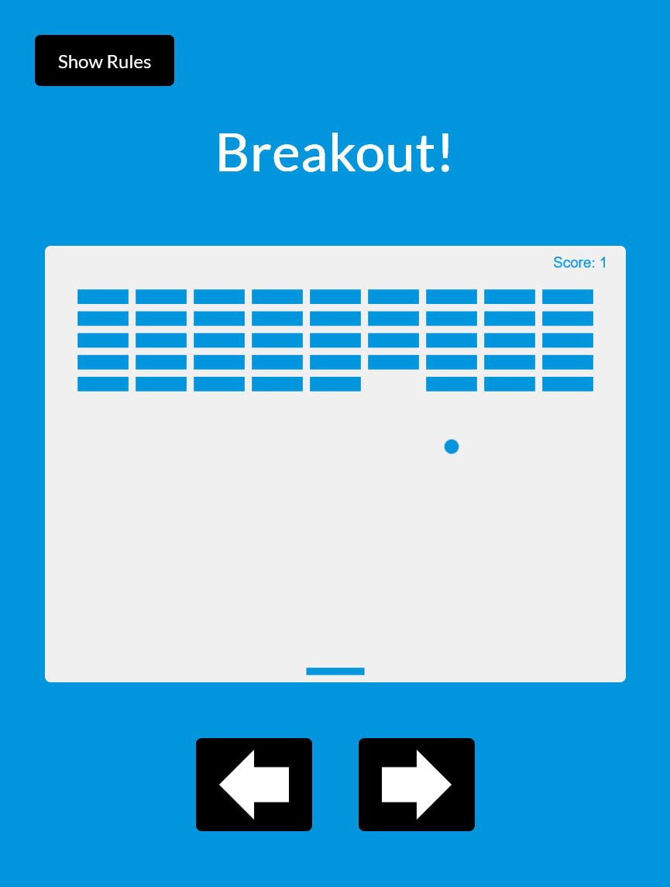

# Breakout!

This is a project based on Brad Traversy's [20 Web Projects With Vanilla JavaScript](https://www.udemy.com/course/web-projects-with-vanilla-javascript/) course on Udemy.

## Table of contents

- [Overview](#overview)
  - [About](#about)
  - [Screenshot](#screenshot)
  - [Links](#links)
- [My process](#my-process)
  - [Built with](#built-with)
  - [What I learned](#what-i-learned)
- [Author](#author)

## Overview

### About

Use your right and left keys or the right and left buttons on the screen to move the paddle to bounce the ball up and break the blocks.

If you miss the ball, your score and the blocks will reset.

### Screenshot

### Links

- Live Site URL: [N.A.]()

## My process

### Built with

- HTML
- CSS
- JavaScript
- Vite

## Author

- Twitter - [@josh76543210](https://www.twitter.com/josh76543210)
- GitHub - [@josh76543210](https://www.github.com/josh76543210)
