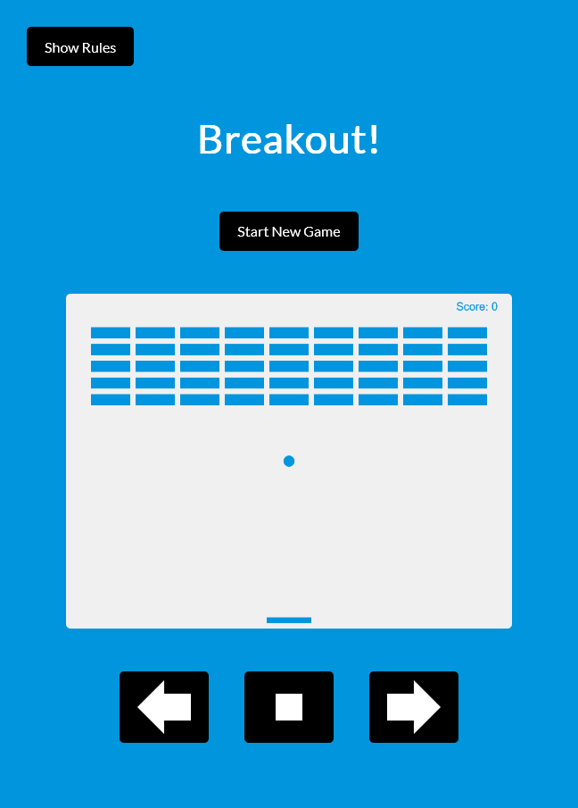

# Breakout!

This is a project based on Brad Traversy's [20 Web Projects With Vanilla JavaScript](https://www.udemy.com/course/web-projects-with-vanilla-javascript/) course on Udemy.

## Table of contents

- [Overview](#overview)
  - [How To Play](#how-to-play)
  - [Screenshot](#screenshot)
  - [Links](#links)
- [My process](#my-process)
  - [Built with](#built-with)
  - [What I learned](#what-i-learned)
- [Author](#author)

## Overview

### How to Play:

Click "Start New Game" to start the game.

Move the paddle on the bottom of the game screen to keep the ball from hitting the bottom.

If you miss the ball, it's game over!

If the ball hits a brick that brick will be destroyed. Destroy all bricks to win the game!

#### Controls:

##### Keyboard

Use your right and left keys to move the paddle to bounce the ball up and break the blocks. Let go of the keys to stop the paddle.

##### Buttons

Use the right and left arrow buttons on the screen to move the paddle and click the middle button to stop the paddle.

### Screenshot



### Links

- Live Site URL: [https://breakout.webthesite.com/](https://breakout.webthesite.com/)

## My process

### Built with

- HTML
- CSS
- JavaScript
- Vite

### What I learned

Using HTML5 canvas:

```html
<canvas id="canvas" width="800" height="600"></canvas>
```

## Author

- Twitter - [@josh76543210](https://www.twitter.com/josh76543210)
- GitHub - [@josh76543210](https://www.github.com/josh76543210)
